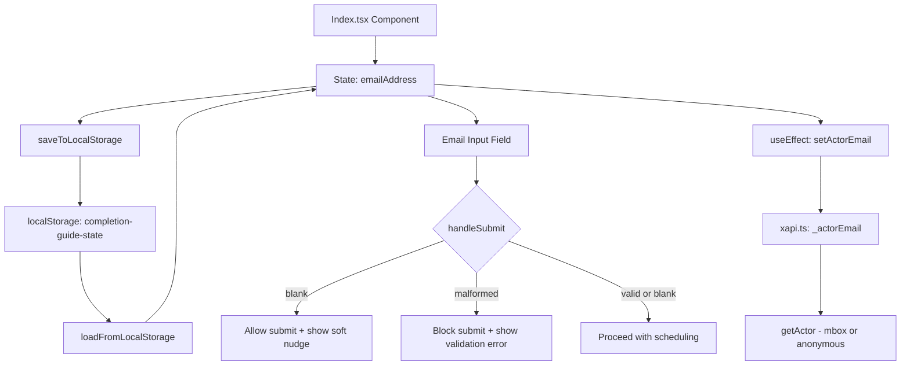

# Design Document: Email Address Input

## Overview

This feature adds an email address input field to the existing completion-guide form in `client/pages/Index.tsx`. The email field sits beside the completion date input, persists to localStorage, and provides soft validation (nudge for blank, block for malformed). When a valid email is provided, it is used as the xAPI actor identifier (via `mbox` mailto IFI) so that xAPI statements can identify users by email. When no email is provided, xAPI falls back to the existing anonymous account-based identifier.

Changes touch `client/pages/Index.tsx` (state, layout, validation), `client/lib/xapi.ts` (actor email integration), and `vite.config.ts` (dev server file access fix).

## Architecture

The change spans the `Index` component and the xAPI module.



Key architectural decisions:

1. **Single state variable**: `emailAddress` is a simple `string` state, initialized to `""`. No separate validation state is needed — validation is derived at submit time and on blur.
2. **Validation approach**: A regex check (`/^[^\s@]+@[^\s@]+\.[^\s@]+$/`) is used for malformed detection. This is intentionally permissive — it catches obvious mistakes (missing `@`, missing domain) without rejecting valid edge-case addresses.
3. **xAPI actor integration**: The email is synced to the xAPI module via `setActorEmail()` in a `useEffect`. When set, `getActor()` returns a `mbox` mailto IFI; when empty, it falls back to the anonymous UUID-based account.
4. **Layout restructure**: The existing `max-w-[262px]` wrapper around the completion date section is widened to accommodate both fields side-by-side at `sm+` breakpoints, using a flex row that stacks on mobile.

## Components and Interfaces

No new components or interfaces are created. The changes are scoped to the `Index` component and `client/lib/xapi.ts`:

### State Addition

```typescript
const [emailAddress, setEmailAddress] = useState<string>("");
const [emailTouched, setEmailTouched] = useState(false);
```

### Validation Helper (inline in Index.tsx)

```typescript
const isValidEmail = (email: string): boolean => {
  return /^[^\s@]+@[^\s@]+\.[^\s@]+$/.test(email);
};
```

### Layout Change

The current completion date wrapper:
```tsx
<div className="flex flex-col items-center gap-4 w-full max-w-[262px]">
```

Becomes a responsive two-column container:
```tsx
<div className="flex flex-col sm:flex-row items-start justify-center gap-4 w-full max-w-[600px]">
  {/* Completion date column */}
  <div className="w-full sm:w-auto flex flex-col gap-1.5">...</div>
  {/* Email column */}
  <div className="w-full sm:w-auto flex flex-col gap-1.5">...</div>
</div>
```

### Email Input Element

```tsx
<label htmlFor="email-input" className="text-center text-black text-base font-bold font-lato">
  Enter your email address:
</label>
<input
  id="email-input"
  type="email"
  autoComplete="email"
  placeholder="name@example.com"
  value={emailAddress}
  onChange={(e) => setEmailAddress(e.target.value)}
  className="w-full px-4 py-3 text-center border-[1.4px] border-black/30 rounded text-lg"
/>
```

### Inline Messages

- **Soft nudge** (amber text, shown when email is blank after interaction or on submit):
  ```tsx
  <p className="text-sm text-amber-600 font-lato">Providing an email is recommended.</p>
  ```

- **Validation error** (red text, shown when email is malformed):
  ```tsx
  <p className="text-sm text-red-600 font-lato">Please enter a valid email address.</p>
  ```

### handleSubmit Changes

The existing `handleSubmit` gains an email validation gate before the scheduling logic:

```typescript
// After existing date/day checks, before scheduling:
if (emailAddress.trim() !== "" && !isValidEmail(emailAddress.trim())) {
  // Block submit — malformed email
  return;
}
// If blank, allow through (soft nudge is shown but doesn't block)
```

### xAPI Actor Integration (in `client/lib/xapi.ts`)

A module-level email variable and setter are added:

```typescript
let _actorEmail = "";

export function setActorEmail(email: string) {
  _actorEmail = email;
}
```

The existing `getActor()` function is updated to use the email when available:

```typescript
function getActor() {
  if (_actorEmail) {
    return { mbox: `mailto:${_actorEmail}` };
  }
  const userId = getOrCreateUserId();
  return {
    account: {
      homePage: "https://academyproduct.github.io/dynamic_completion_guide",
      name: userId,
    },
  };
}
```

In `Index.tsx`, a `useEffect` syncs the email state to the xAPI module:

```typescript
useEffect(() => {
  setActorEmail(emailAddress.trim());
}, [emailAddress]);
```

### Vite Config Fix (in `vite.config.ts`)

The `server.fs.allow` list is updated to include the project root so that `index.html` can be served during local development:

```typescript
fs: {
  allow: [path.resolve(__dirname)],
}
```

## Data Models

### localStorage State Shape (updated)

The `completion-guide-state` JSON object gains one new field:

```typescript
interface LocalStorageState {
  selectedDays: string[];
  minutesPerDay: Record<string, number>;
  completionDate: string;
  submitted: boolean;
  weeks: EnhancedWeekSchedule[];
  checkedTaskIds: number[];
  warnings: { unallocatedTasks: boolean; exceededDate: boolean };
  emailAddress: string; // NEW — defaults to "" if missing
}
```

**Save**: `saveToLocalStorage` includes `emailAddress` in the serialized object.

**Load**: `loadFromLocalStorage` reads `state.emailAddress || ""`, so existing users without the field get a clean empty default.

No database, API, or server-side data model changes are needed.

## Correctness Properties

*A property is a characteristic or behavior that should hold true across all valid executions of a system — essentially, a formal statement about what the system should do. Properties serve as the bridge between human-readable specifications and machine-verifiable correctness guarantees.*

### Property 1: Email localStorage Round-Trip

*For any* string value stored as `emailAddress` in the localStorage state object, saving via `saveToLocalStorage` and then loading via `loadFromLocalStorage` should restore the identical string value.

**Validates: Requirements 3.1, 3.2, 7.4**

### Property 2: Email Validation Correctness

*For any* non-empty string, the `isValidEmail` function should return `true` if and only if the string contains exactly one `@` separating a non-empty local part (no spaces) from a non-empty domain part (no spaces) containing at least one `.`. For any string that fails this check, `handleSubmit` should not proceed to scheduling.

**Validates: Requirements 5.1, 5.2**

### Property 3: Scheduler Independence from Email

*For any* two distinct email address values (including empty string), given identical scheduling inputs (selectedDays, minutesPerDay, taskPool, completionDate), the `greedyScheduleTasks` function should produce identical week schedules.

**Validates: Requirements 6.1**

## Error Handling

| Scenario | Behavior | User Feedback |
|---|---|---|
| Malformed email on submit | `handleSubmit` returns early, does not run scheduling | Red inline text: "Please enter a valid email address." below the email input |
| Blank email on submit | Submission proceeds normally | Amber inline text: "Providing an email is recommended." below the email input (non-blocking) |
| localStorage save fails | Caught by existing try/catch in `saveToLocalStorage` | `console.error` logged; no user-facing error (matches existing behavior) |
| localStorage load with missing `emailAddress` key | Defaults to `""` via `state.emailAddress \|\| ""` | No message; input renders empty |
| localStorage contains corrupted/non-string emailAddress | Falls back to `""` via the `\|\| ""` guard | No message; input renders empty |

No new error boundaries or error states are introduced. The existing try/catch pattern in `saveToLocalStorage` and `loadFromLocalStorage` handles storage failures.

## Testing Strategy

### Unit Tests (Vitest)

Example-based tests for specific scenarios:

- **Rendering**: Email input exists with correct `type`, `autocomplete`, `placeholder`, `id`, and associated `label[htmlFor]` (Requirements 1.1–1.4)
- **Blank submit**: Submitting with blank email proceeds and shows soft nudge (Requirements 4.1, 4.2, 4.3)
- **Malformed submit**: Submitting with `"notanemail"` blocks and shows red validation message (Requirements 5.1, 5.3)
- **Styling consistency**: Email input and label share the same CSS classes as the date input and label (Requirements 8.1, 8.2)
- **Missing localStorage field**: Loading state without `emailAddress` defaults to `""` (Requirement 3.3)
- **xAPI actor integration**: Mock xAPI module, type a valid email, verify `setActorEmail` is called with the email value (Requirement 7.1)

### Property-Based Tests (Vitest + fast-check)

Each property test runs a minimum of 100 iterations and is tagged with its design property reference.

- **Property 1 — Email localStorage Round-Trip**: Generate arbitrary strings via `fc.string()`, save to localStorage state, load back, assert equality.
  - Tag: `Feature: email-address-input, Property 1: Email localStorage Round-Trip`

- **Property 2 — Email Validation Correctness**: Generate arbitrary non-empty strings via `fc.string({ minLength: 1 })`. For each, check that `isValidEmail` returns `true` only when the string matches the expected pattern (has `@`, non-empty parts, domain with `.`). Also generate known-valid emails via a custom arbitrary and verify they pass.
  - Tag: `Feature: email-address-input, Property 2: Email Validation Correctness`

- **Property 3 — Scheduler Independence from Email**: Generate two arbitrary email strings and fixed scheduling inputs. Run `greedyScheduleTasks` for both and assert deep equality of the output.
  - Tag: `Feature: email-address-input, Property 3: Scheduler Independence from Email`

### Integration Tests

- **Responsive layout**: Verify side-by-side at `sm+` and stacked below `sm` (Requirements 2.1, 2.2) — best done with visual/manual testing or a viewport-aware test runner.
- **xAPI actor verification**: Verify that xAPI statements use `mbox` mailto IFI when email is provided, and fall back to anonymous account when blank (Requirements 7.1, 7.2).

### What's Not Tested via PBT

- UI rendering, layout, and styling (Requirements 1.x, 2.x, 8.x) — covered by example-based unit tests and visual review
- Soft nudge display logic (Requirement 4.x) — covered by example-based tests since the trigger conditions are specific (blank email)
- Code organization constraints (Requirement 6.2) — verified by code review
